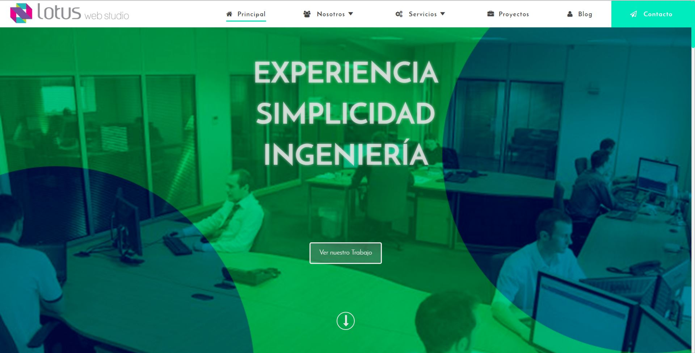
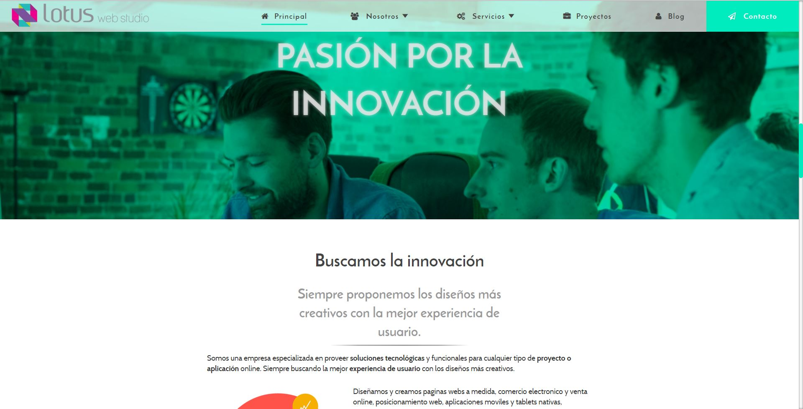
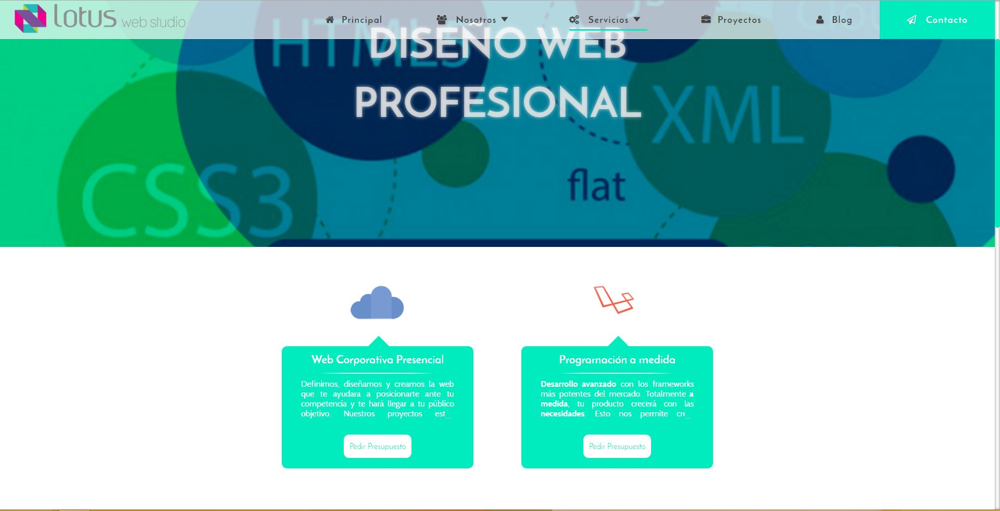
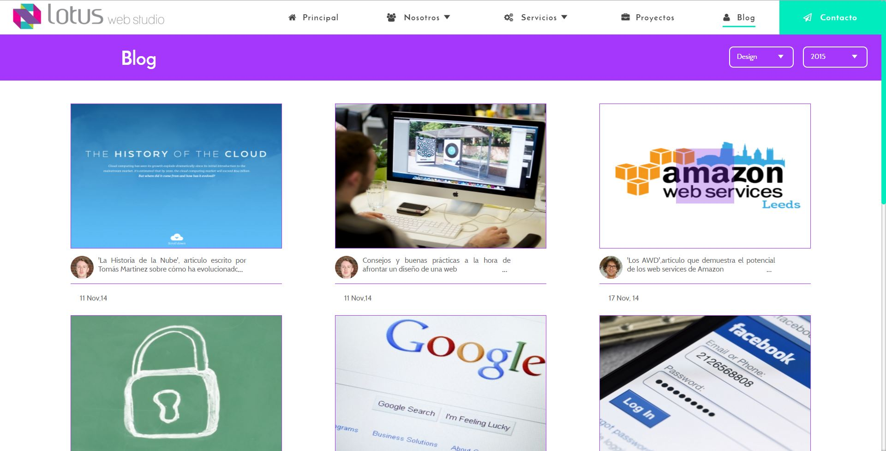
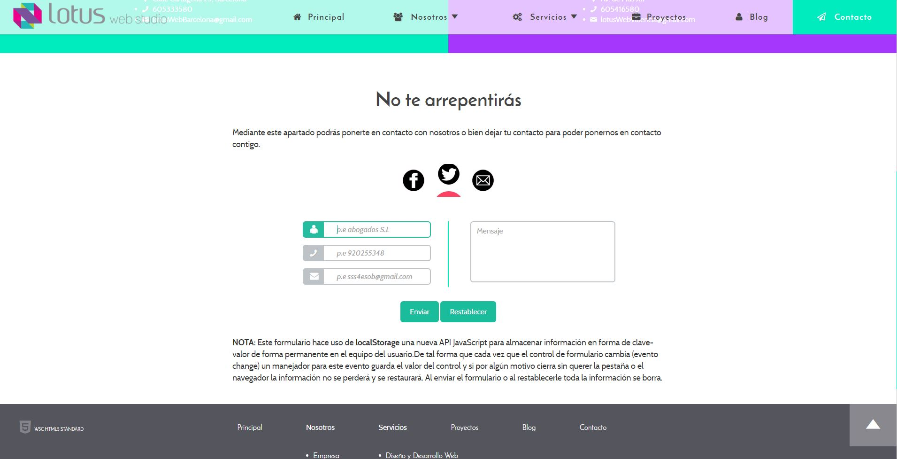

# Lotus Web Studio - Final Project Module (Web Interface Development) 💻🎨🚀  

## ⚠️ Disclaimer  
**This is a practice project created as part of a web development training program.** Lotus Web Studio is **not a real agency**, and this repository serves as an educational exercise in **HTML5, CSS3, and JavaScript**. The project was developed as a final module assignment focusing on **Web Interface Development**.  

## Overview  
🌟 Welcome to the Lotus Web Studio repository, the shining result of our hard work during the Final Project module focusing on Web Interface Development. In this project, we've harnessed the power of **JavaScript**, embraced the versatility of **HTML5**, and applied the artistry of **CSS3** to craft a one-of-a-kind website tailored for an **innovative engineering studio**.  

## About Lotus Web Studio 🏢💼  
Lotus Web Studio is a **fictional web design agency** created for learning purposes. The project simulates a real-world scenario where a **forward-thinking engineering firm** seeks to revolutionize its online presence and showcase its impressive portfolio. This exercise allowed us to practice **professional web design principles** while building a visually compelling and responsive website.  

## Key Features ✨🔑  
- **Custom Design**: The web interface is meticulously tailored to reflect innovation and professionalism.  
- **JavaScript Magic**: Interactive and dynamic elements enhance user engagement.  
- **HTML5 Foundation**: A modern, accessible, and responsive website structure.  
- **CSS3 Styling**: Elegant and sophisticated visuals that elevate the user experience.  

## Screenshots 📷🖼️  
Here are some screenshots of this web design project:  

## Visitors Count

## Please Share & Star the repository to keep me motivated.
  
  

